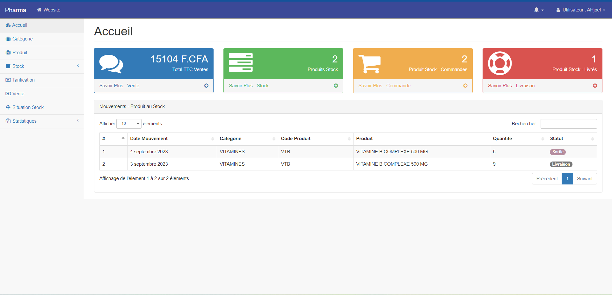

## Application de Gestion du Stock de Phamarcie - Cabinet Médical 

Application disponible ici : https://stockpharma.onrender.com/





## Configuration - windows

Clonez le repository et accéder au dossier cloné :

```sh
$ git clone https://github.com/ahjoel/Gestion-cabinet-medical.git
$ cd core
```

Créez un environnement virtuel et activez le:

```sh
$ python -m venv .env
$ source .env/scripts/activate
```

Installez les dépendances nécessaires :

```sh
(.env)$ pip install -r requirements.txt
```
Notez que `(env)` en début de la session indique que vous avez activez votre envrionnement
virtuel.

Connectez une base de données postgressql :
https://docs.djangoproject.com/fr/4.2/ref/databases/#postgresql-notes

Créez un compte administrateur :
```sh
(.env)$ python manage.py createsuperuser
```

Après la création de compte administrateur, migrez les données initiales vers la base de données :
```sh
(.env)$ python manage.py migrate
```

Finalement démarrez le serveur :
```sh
(.env)$ python manage.py runserver
```